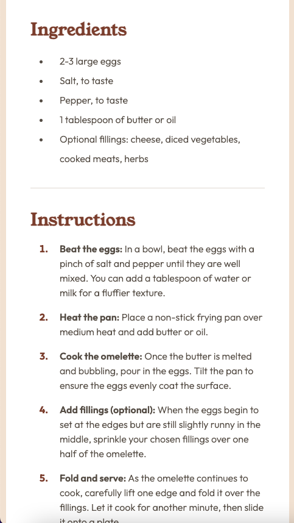

# Frontend Mentor - Recipe page solution

This is a solution to the [Recipe page challenge on Frontend Mentor](https://www.frontendmentor.io/challenges/recipe-page-KiTsR8QQKm). Frontend Mentor challenges help you improve your coding skills by building realistic projects.

## Table of contents

- [Overview](#overview)
  - [The challenge](#the-challenge)
  - [Screenshot](#screenshot)
  - [Links](#links)
- [My process](#my-process)
  - [Built with](#built-with)
  - [What I learned](#what-i-learned)
  - [Continued development](#continued-development)
  - [Useful resources](#useful-resources)
- [Author](#author)
- [Acknowledgments](#acknowledgments)

**Note: Delete this note and update the table of contents based on what sections you keep.**

## Overview

### Screenshot

Desktop : 


Mobile : 




### Links

- Solution URL: [Github.com](https://github.com/CSE-Kyle/recipe-page)
- Live Site URL: [Netlify.com](https://clever-churros-9c9f1f.netlify.app)

## My process

### Built with

- Semantic HTML5 markup
- CSS custom properties
- CSS Flexbox
- Mobile-first workflow
- [Styled Components](https://styled-components.com/) - For styles

**Note: These are just examples. Delete this note and replace the list above with your own choices**

### What I learned

Learning how to organize and align data by using the table semantic.

To see how you can add code snippets, see below:

```html
<table>
  <tr>
    <td>Calories</td>
    <td class="value">277kcal</td>
  </tr>

  <tr>
    <td>Carbs</td>
    <td class="value">0g</td>
  </tr>

  <tr>
    <td>Protein</td>
    <td class="value">20g</td>
  </tr>

  <tr>
    <td>Fat</td>
    <td class="value">22g</td>
  </tr>
</table>
```

### Continued development

- improve my positioning of HTML elements with CSS using Flexbox and Grid. Whether if it's photos, text, etc. 

### Useful resources

- [w3schools](https://www.w3schools.com/html/html_tables.asp) - A primary internet resource that I used for researching on how to create tables and being specific on selecting certain elements in HTML and editing the CSS properties to go with it.
- [youtube.com](https://www.youtube.com/) - Another resource I referred to anytime I visually need to see how certain HTML/CSS properties change when done so.
- [figma](https://www.figma.com) - Design tool that I use to see the design specifications so that I can convert them into code.


## Author

- Website - [Kyle Deguzman (CSE-Kyle)](https://www.your-site.com)
- Frontend Mentor - [@CSE-Kyle](https://www.frontendmentor.io/profile/CSE-Kyle)

## Acknowledgments

- Frontend Mentor Community! 🙌🏼 

[Frontend Mentor Discord](https://discord.com/invite/frontend-mentor-824970620529279006)
